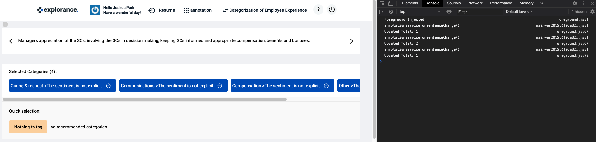
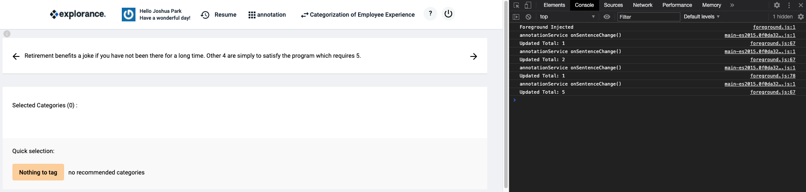

# Annotation Extension for Blue Annotation
## Annotation Counter - (MVP Complete)

### Description
- Browser extension that tracks the number of annotations the user has applied during the current session.

### Content Descriptions
* background.js : Background file that monitors tabs and injects foreground script accordingly.
* foreground.js : Contains main logic for the counter.
* popup.js : TODO implement display method

### Usage
1. Open the annotation tool and have everything ready.
2. Navigate to chrome://extensions and turn the extension on.
3. Switch back onto the annotation tab and work as per usual. 
4. Total annotations will be logged to the console. (Right click -> Inspect -> Console)
5. Turn the extension off in chrome://extensions when finished.

### Issues / Solutions
1. prev_next variable that gets the button HTML element is being redefined everytime the annotation tab becomes the active tab.
    - (Solution) Boolean flag in background script, turns false immediately after injecting foreground script once.

2. Event listener on the buttons is being called multiple times for some reason.
    - NOTE: Everytime you click off the tab and click back on, the script gets re-injected thus doubling the number of event listeners. \newline

    - (Solution) Boolean flag that only injects the script once actually fixed the problem.

### Example Usage:

