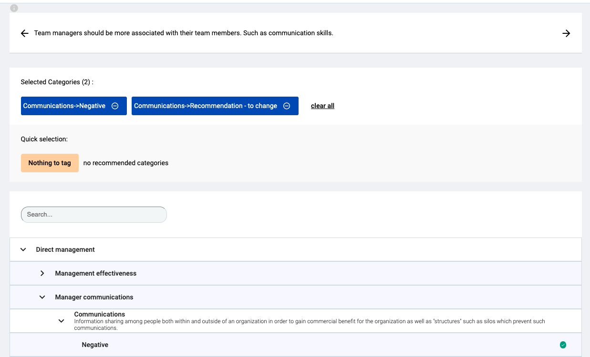

# Annotation Extension for Blue Annotation
## Annotation Counter

### Description
- Browser extension that tracks the number of annotations the user has applied during the current session. 
- Uses **Chrome API's** to track annotations and display them onto the extension window.
- Uses **Web Storage API** to locally store the number of tags, to be retrieved in the popup script.

### Usage Instructions
1. Open the annotation tool and have everything ready.
2. Go to chrome://extensions and turn the extension on.
3. Work as per usual.
5. Turn the extension off in chrome://extensions when finished.

### Content Descriptions
* background.js : Background file that monitors tabs and injects foreground script accordingly. Receives the message from runtime API and stores locally using Web Storage API.
* foreground.js : Contains main logic for the counter and sendMessage from runtime API.
* popup.js : Updates the value displayed on the popup.

### Example Usage:

